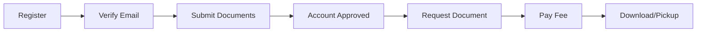

<div align="center">

# 🌉 BRIDGE System

### **B**arangay **R**equest **I**nformation and **D**ocument **G**ateway for **E**-Services

*Bringing your barangay online*

[](https://reactjs.org/)
[](https://dotnet.microsoft.com/)
[](https://www.mongodb.com/)
[](https://www.typescriptlang.org/)

[Features](#-features) • [Demo](#-demo) • [Tech Stack](#-tech-stack) • [Getting Started](#-getting-started) • [Documentation](#-documentation)

</div>

---

## 📖 About

The **BRIDGE System** is a modern digital platform that simplifies transactions between barangay governments and citizens. By integrating the most sought-after barangay document services into one unified online system, BRIDGE minimizes economic costs and maximizes convenience for Filipino communities.

### 🎯 Vision
Building a connected nation where every Filipino can access essential barangay services online, anytime, anywhere.

---

## ✨ Features

### 👥 For Residents
- **🔐 Secure Authentication** - Email verification with OTP, Google OAuth integration
- **📄 Document Requests** - Request barangay clearance, certificates of residency, indigency certificates
- **💳 Multiple Payment Options** - GCash online payment, cash on pickup, or free documents
- **📱 Real-time Notifications** - Stay updated on your request status via SignalR
- **📊 Personal Dashboard** - Track all your document requests in one place
- **📁 Document Upload** - Secure file uploads for supporting documents via Cloudinary
- **✅ Identity Verification** - Submit verification documents for account approval

### 🛠️ For Staff
- **📋 Request Management** - Review and process document requests
- **✔️ Approval Workflow** - Approve or reject requests with detailed feedback
- **💰 Payment Verification** - Verify GCash payments with proof of payment
- **👤 Resident Management** - View and manage resident accounts
- **🔔 Real-time Updates** - Instant notifications for new requests

### 👑 For Administrators
- **⚙️ Barangay Configuration** - Customize barangay details, logo, office hours
- **💵 GCash Settings** - Configure GCash payment details and QR codes
- **📜 Document Management** - Add, edit, and manage available document types
- **👥 Staff Management** - Create and manage staff accounts with role-based access
- **📊 Analytics Dashboard** - View statistics, trends, and recent activities
- **📧 Email Notifications** - Automated emails via Resend API

---

## 🚀 Demo

### User Flow



### Request in 3 Simple Steps

1. **🔑 Register an Account** - Provide your details and verify with OTP
2. **📤 Submit Request** - Complete the online form and upload required documents
3. **📥 Receive Document** - Download your verified digital document or claim at the office

---

## 🛠️ Tech Stack

### Frontend
- **React 19.1** with TypeScript
- **Vite** for blazing-fast builds
- **TanStack Query** for server state management
- **React Router** for navigation
- **Tailwind CSS** + **shadcn/ui** for modern UI components
- **Radix UI** for accessible primitives
- **SignalR** for real-time updates
- **React Hook Form** + **Zod** for form validation
- **Axios** for API requests
- **Recharts** for data visualization

### Backend
- **ASP.NET Core 9.0** Web API
- **MongoDB** with MongoDB.Driver
- **JWT** authentication with refresh tokens
- **BCrypt.NET** for password hashing
- **SignalR** for real-time notifications
- **Resend** for email service
- **Cloudinary** for file storage
- **QuestPDF** for PDF generation
- **QRCoder** for QR code generation

### DevOps & Tools
- **Docker** support
- **Render.com** deployment ready
- **Environment-based configuration**
- **CORS** configured for security
- **Rate limiting** for API protection

---

## 📦 Getting Started

### Prerequisites

- **Node.js** 18+ and npm/pnpm
- **.NET 9.0 SDK**
- **MongoDB** (local or Atlas)
- **Cloudinary** account
- **Resend** account (for emails)

### Installation

#### 1️⃣ Clone the repository

```bash
git clone https://github.com/yourusername/bridge-system.git
cd bridge-system
```

#### 2️⃣ Setup Backend

```bash
cd server

# Create .env file
cat > .env << EOF
MONGODB_URI=your_mongodb_connection_string
JWT_KEY=your_secure_jwt_key_min_32_chars
RESEND_API_KEY=your_resend_api_key
RESEND_FROM_EMAIL=noreply@yourdomain.com
RESEND_FROM_NAME=Bridge System
CLOUDINARY_CLOUD_NAME=your_cloudinary_cloud_name
CLOUDINARY_API_KEY=your_cloudinary_api_key
CLOUDINARY_API_SECRET=your_cloudinary_api_secret
GOOGLE_CLIENT_ID=your_google_oauth_client_id
ALLOWED_ORIGINS=http://localhost:5173,http://localhost:5174
EOF

# Restore packages and run
dotnet restore
dotnet run
```

#### 3️⃣ Setup Frontend

```bash
cd client

# Install dependencies
npm install
# or
pnpm install

# Create .env file
cat > .env << EOF
VITE_API_URL=http://localhost:5239/api
VITE_GOOGLE_CLIENT_ID=your_google_oauth_client_id
VITE_CLOUDINARY_CLOUD_NAME=your_cloudinary_cloud_name
VITE_CLOUDINARY_API_KEY=your_cloudinary_api_key
VITE_CLOUDINARY_API_SECRET=your_cloudinary_api_secret
EOF

# Start development server
npm run dev
```

#### 4️⃣ Access the Application

- **Frontend**: http://localhost:5173
- **Backend API**: http://localhost:5239
- **Swagger Docs**: http://localhost:5239/swagger

---

## 📂 Project Structure

```
bridge-system/
├── client/                    # React frontend
│   ├── src/
│   │   ├── features/         # Feature-based modules
│   │   │   ├── auth/        # Authentication
│   │   │   ├── resident/    # Resident features
│   │   │   ├── staff/       # Staff features
│   │   │   ├── admin/       # Admin features
│   │   │   ├── document/    # Document management
│   │   │   └── landing/     # Landing page
│   │   ├── components/      # Shared components
│   │   ├── lib/            # Utilities & configs
│   │   └── hooks/          # Custom React hooks
│   └── package.json
│
└── server/                   # .NET backend
    ├── src/
    │   ├── Controllers/     # API endpoints
    │   ├── Services/        # Business logic
    │   ├── Models/          # Data models
    │   ├── DTOs/            # Data transfer objects
    │   ├── Hubs/            # SignalR hubs
    │   └── Filters/         # Custom filters
    └── server.csproj
```

---

## 🔐 Security Features

- ✅ **JWT Authentication** with secure token generation
- ✅ **Password Hashing** using BCrypt
- ✅ **Email Verification** with OTP
- ✅ **Rate Limiting** to prevent abuse
- ✅ **CORS Protection** with whitelist
- ✅ **Input Validation** using Zod schemas
- ✅ **XSS Protection** headers
- ✅ **Secure File Uploads** to Cloudinary
- ✅ **Environment Variable** secrets management

---

## 📊 Payment Methods

### 1. **GCash Online Payment**
- Residents pay via GCash before document processing
- Upload proof of payment
- Staff verifies payment before approval

### 2. **Cash on Pickup**
- Request document online
- Pay when picking up at barangay office
- Staff marks payment as received

### 3. **Free Documents**
- No payment required
- Automatic processing after approval
- Immediate download available

---

## 🔔 Real-time Features

### SignalR Integration
- **Live Notifications** - Instant updates when request status changes
- **Role-based Broadcasting** - Targeted notifications for residents, staff, and admins
- **Connection Management** - Auto-reconnection on network issues
- **Unread Count** - Real-time unread notification counter

---

## 📧 Email Service

Powered by **Resend API** for reliable email delivery:

- ✉️ **Email Verification** with OTP codes
- 🔒 **Password Reset** emails
- 📬 **Document Status Updates** notifications
- 🎨 **Branded Templates** with HTML formatting

---

## 🎨 UI/UX Highlights

- **🌓 Dark Mode** support with next-themes
- **📱 Fully Responsive** design (mobile-first)
- **♿ Accessible** components via Radix UI
- **🎭 Smooth Animations** with Tailwind CSS
- **🎨 Modern Design** with shadcn/ui components
- **⚡ Fast Loading** with code splitting and lazy loading

---

## 📝 Available Documents

| Document | Description | Payment Required |
|----------|-------------|------------------|
| **Barangay Clearance** | Certificate of good moral character | ✅ Yes |
| **Certificate of Residency** | Proof of residence in barangay | ✅ Yes |
| **Certificate of Indigency** | Financial assistance document | ❌ Usually Free |
| **Business Permit Clearance** | Required for business registration | ✅ Yes |

---

## 🚢 Deployment

### Production Deployment

**Live URLs:**
- 🌐 **Frontend:** https://bridgesystem.abrdns.com (Vercel)
- 🔧 **Backend:** https://bridge-system-api.onrender.com (Render)
- 📚 **API Docs:** https://bridge-system-api.onrender.com/swagger

### Quick Deploy (60 minutes)

```bash
# 1. Setup Resend for emails
#    - Create account at resend.com
#    - Add domain: bridgesystem.abrdns.com
#    - Configure DNS records
#    - Generate API key

# 2. Deploy Frontend to Vercel
#    - Import Git repository
#    - Configure root directory: client
#    - Add environment variables
#    - Add custom domain

# 3. Update Backend on Render
#    - Add Resend API key
#    - Update ALLOWED_ORIGINS
#    - Redeploy

# 4. Configure DNS in CloudDNS
#    - Add CNAME for Vercel
#    - Add TXT records for email (SPF, DKIM)

# 5. Test everything
#    - Run: powershell -File verify-deployment.ps1
```

📖 **Full Guides:**
- **Quick Start:** [QUICK_DEPLOY.md](QUICK_DEPLOY.md) - Deploy in 60 minutes
- **Complete Guide:** [DEPLOYMENT_GUIDE.md](DEPLOYMENT_GUIDE.md) - Detailed instructions
- **Checklist:** [DEPLOYMENT_CHECKLIST.md](DEPLOYMENT_CHECKLIST.md) - Step-by-step tasks
- **Vercel:** [VERCEL_DEPLOYMENT.md](VERCEL_DEPLOYMENT.md) - Frontend deployment
- **Resend:** [RESEND_SETUP.md](RESEND_SETUP.md) - Email service setup
- **DNS:** [DNS_CONFIGURATION.md](DNS_CONFIGURATION.md) - DNS configuration

### Using Docker (Local Development)

```bash
# Build and run with Docker Compose
docker-compose up -d
```

---

## 🧪 Testing

```bash
# Frontend tests
cd client
npm run test

# Backend tests
cd server
dotnet test
```

---

## 🤝 Contributing

Contributions are welcome! Please follow these steps:

1. Fork the repository
2. Create a feature branch (`git checkout -b feature/AmazingFeature`)
3. Commit your changes (`git commit -m 'Add some AmazingFeature'`)
4. Push to the branch (`git push origin feature/AmazingFeature`)
5. Open a Pull Request

---

## 📄 License

This project is licensed under the MIT License - see the [LICENSE](LICENSE) file for details.

---

## 👨‍💻 Authors

- **Your Name** - *Initial work* - [@yourhandle](https://github.com/yourhandle)

---

## 🙏 Acknowledgments

- **shadcn/ui** for beautiful UI components
- **Vercel** for hosting the design system
- **MongoDB** for database solutions
- **Resend** for email infrastructure
- **Cloudinary** for file storage
- **The Filipino community** for inspiring this project

---

## 📞 Support

For support, email support@bridgesystem.com or open an issue on GitHub.

---

<div align="center">

### Made with ❤️ for Filipino Communities

**⭐ Star this repo if you find it helpful!**

[Report Bug](https://github.com/yourusername/bridge-system/issues) • [Request Feature](https://github.com/yourusername/bridge-system/issues)

</div>
